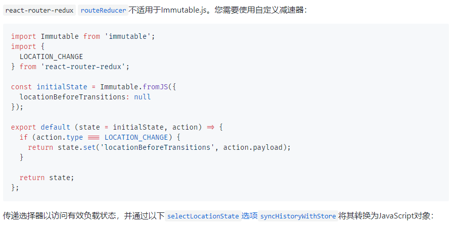

## 介绍

开发中因受限英语水平, 难免借助 Googl 翻译文档, 但是有时候它会搞乱排版, 就像下面这样.

这个扩展就是修复它.

## 使用

#### 刷新页面后

### 为什么有几种颜色?

他们代表三种需求.

- 左键蓝色: 不翻译此区域,并且运用自定义样式, 比如修改代码的字体, 大小等.
- 右键绿色: 不翻译此区域, 不运用自定义样式, 也就是说,不修改外观.
- 中键黄色: 强制翻译, 有时候 google 翻译会对某些区域不翻译, 但是我们需要对它翻译,就用中键.

除了三个按键, 还有支持滚轮, 调节 DOM 范围, 实现细腻化选择, 就像下面这样.

## 管理页面

在管理你可以查看, 你所选取的元素, 支持增删改, 以及每个域名自定义样式.

## 安装

下载压缩文件包,然后解压, 在 Chrome 中加载.

或者将源代码中的`dist`文件, 加载到 Chrome 中也可以.

## 总结

控制 Chrome 翻译或不翻译,主要由两个类名决定, `notranslate` 和 `translate`.

也就是说在网页加载那一刻, 需要完成对选定 DOM 元素遍历并添加上类名.

在 CSS 方面使用的是动态选择器, 无需遍历, 使用CSS选择器自动运用样式, 总体来说,流畅无阻塞,并且无侵入.

即使这个扩展不用来修复翻译排版, 也可以用来美化代码排版, 用你喜爱的字体 ,比如 `Fira Code`.

## 瑕疵

当网络特别阻塞的时候, Google 翻译会抢先翻译, 这个时候刷新页面即可, 而不是扩展没有起作用.

还有一些网站是动态渲染, 类名是动态生成的, 这也就造成了明明第一次选中,但刷新后没有生效, 可以通过调节 DOM 范围,更大或更小,来避开这个类.

## 小提示

这个扩展追求简洁,设计成了无菜单项, 要启动选择功能, 直接点击图标.
也有快捷键, `Ctrl+q` 启动, `Esc` (Exit) 退出

## 未来计划

Chrome 给的免费云存储只有100k, 未来将打算将gists作为存储备份方案

最重要的就是上架到Google商店.

